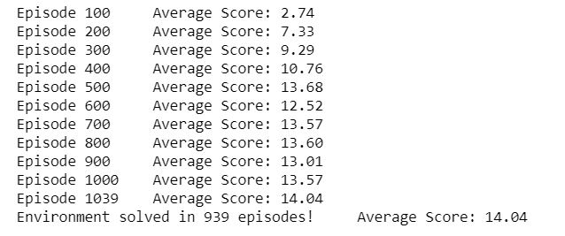
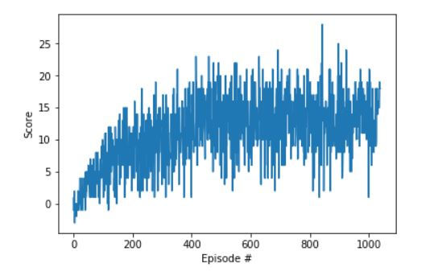
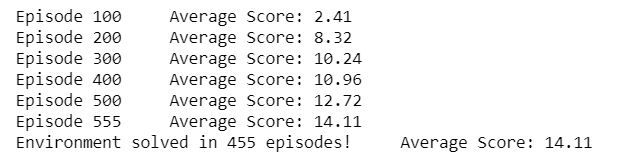
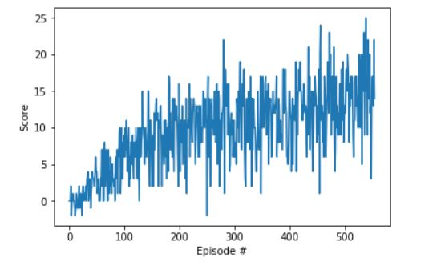

# Navigation Project Report

The objective of this project is to train a reinforcement learning agent to navigate in a given (virtual) 2D world contains yellow and blue bananas.
The agent is supposed to collect as many yellow bananas as possible while avoiding blue bananas. 
A value based approach is used to learn the optimal policy using Deep Q-learning that combine:
- Q-learning algorithm which is an offline policy learning. 
- Deep neural network to act as Q-table approximation and learn state-action mapping.

The adopted algorithm includes two improvements to the vanilla Deep Q-learning named as: 
- Experience Replay.
- Fixed Q-values. 

These changes were introduced in ["Human-level control through deep reinforcement learning"](https://storage.googleapis.com/deepmind-media/dqn/DQNNaturePaper.pdf) paper

## Learning Algorithm 
The implementation of DQN agent is organized in three main files:  
- `Navigation.ipynb` where the environment setting, agent initalization, and traingin management are executed. 
- `dqn_agent.py` where the learning agent is defined
- `model.py` where the neural network is defined 
 
### Algorithm 
The work in this project is part of the provided framework by Udacity implementing the DQN. The following screenshot is taken from DQN explanation in Deep Reinforcement Learning Nanodegree.


### Nework Architecture 
The designed neural network consists of a 37 dimension input layer, three hidden layers, and an output layer (with 4 outputs)
- First hidden layer: 
  - Input dimension: 37
  - Output dimension: 64 
  - Activation Function: ReLu 
- Second hidden layer: 
  - Input dimension: 64
  - Output dimension: 64 
  - Activation Function: ReLu
- Third hidden layer: 
  - Input dimension: 64
  - Output dimension: 32
  - Activation Function: ReLu
- Output layer: 
  - Input dimension: 32
  - Output dimension: 4 
  - Activation Function: ReLu

### Hyper parameters 
The algorithm uses the following parameters defined in `dqn_agent.py` besides those passed to DQN agent from `Navigation.ipynb`. 
- Learning parameters 
```
BUFFER_SIZE = int(1e5)  # replay buffer size
BATCH_SIZE = 64         # minibatch size
GAMMA = 0.99            # discount factor
TAU = 5e-3              # for soft update of target parameters
LR = 1e-3               # learning rate 
UPDATE_EVERY = 4        # how often to update the network
```
- Iteration specs and epsilon gready algorithm parameters  
```
dqn(n_episodes=2500, max_t=1000, eps_start=1.0, eps_end=0.001, eps_decay=0.99)
```
## Results: Average Reward 
The agent is supposed to get a reqard = +13 or greater over 100 successive epsiodes. 
This result is achieved in the first 1000 epsiode when we used max_t = 1000 for every episode, 
and achieved in the first 500 epsiodes when we increased max_t for every epsiode to 1500. The results are shown bleow: (Actually our boundary was set to 14)  

- max_t = 1000




- max_t = 1500




## Future work 
There are many possible improvements to conventional DQN algorithm for more stable response and enhanced performance as described in DQN Udacity lesson. Some of these improvemnts may be considered to improve the response of the navigation agent such as:    
- [Double DQN](https://arxiv.org/abs/1509.06461)
  - Idea: select the best action using a set of parameters w, and evaluate that action using another set of parameters w' to overcome the problem of overestimation in conventional DQN.  
- [Prioritized Experience Replay](https://arxiv.org/abs/1511.05952)
  - Idea: while experience replay lets online reinforcement learning agents remember and reuse experiences from the past, prioritizing lets the algorithm replays important transitions more frequently, and therefore learns more efficiently.
- [Dueling DQN](https://arxiv.org/abs/1511.06581)
  - Idea: represents two separate estimators in the final layers of the same network: one for the state value function and one for the state-dependent action advantage function. The main benefit of this factoring is to generalize learning across actions without imposing any change to the underlying reinforcement learning algorithm.
